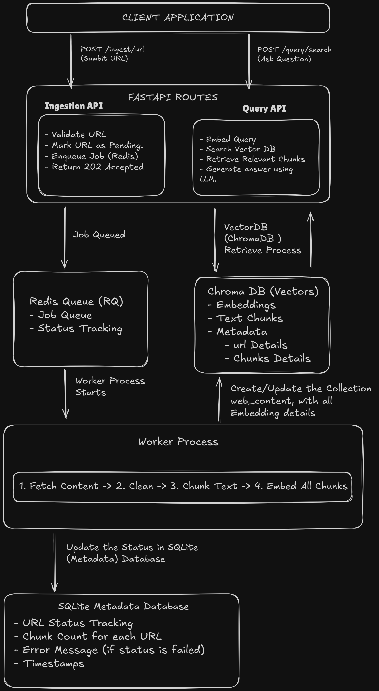

# Web-Aware RAG Engine

**Author:** Shashwat Jain

## Table of Contents


- [Demo Video](https://drive.google.com/file/d/1621dPJ_c8_jmcjfV9vlcBbOQzTSHk2a-/view?usp=sharing) 
- [Overview](#overview)
- [System Architecture](#system-architecture)
- [Technology Stack](#technology-stack)
- [Database Schema](#database-schema)
  - [SQLite Metadata Database](#sqlite-metadata-database)
  - [ChromaDB Vector Database](#chromadb-vector-database)
- [Installation](#installation)
- [Configuration](#configuration)
- [API Documentation](#api-documentation)
  - [Ingestion Endpoints](#ingestion-endpoints)
  - [Query Endpoints](#query-endpoints)
  - [Debugging Endpoints](#debugging-endpoints)
- [Usage](#usage)
- [Project Structure](#project-structure)

---

## Overview

This RAG engine allows users to submit URLs for background processing, where content is semantically indexed via embeddings `(Using the Google Gemini Models)`. Users can then query the indexed knowledge base with natural language questions and receive grounded answers directly sourced from the ingested content, ensuring all responses are based on retrieved documents. LLM model used to generate grounded response `(gemini-2.5-flash)`

---

## System Architecture

### Architecture Diagram




### Data Flow

1. **Ingestion Phase**: User submits URL via REST API -> Validation Rules applied on URL -> FastAPI stores record in SQLite with "pending" status -> Job enqueued to Redis Queue -> RQ Worker picks up job asynchronously -> Returns status code 202.
2. **Processing Phase**: Worker scrapes URL -> Cleans text -> Splits into overlapping chunks -> Generates embeddings via Gemini API -> Stores in ChromaDB with metadata for each embedded chunk.
3. **Query Phase**: User submits question -> Query converted to embedding -> Semantic search in ChromaDB -> Top-K similar chunks retrieved all `>=` minimum similarity -> Gemini generates grounded answer using retrieved context -> Response with citations `urls`

---

## Technology Stack

| Component | Technology | Reasoning |
|-----------|-----------|-----------|
| **Web Framework** | FastAPI | Async-first, fast startup|
| **Task Queue** | Redis + RQ | Asynchronous job processing, simple API, no external dependencies |
| **Vector Database** | ChromaDB | Lightweight, local-first, supports cosine similarity search |
| **Metadata Store** | SQLite | Zero-configuration, file-based, sufficient for metadata tracking |
| **Embeddings** | Google Gemini API | High-quality semantic representations, consistent dimensions (768-dim) |
| **LLM** | Google Gemini API | Advanced reasoning, grounded answer generation from context |
| **ORM** | SQLAlchemy | Type-safe database operations, schema validation |
| **Dependency Management** | Poetry | Lock files for reproducible environments, simpler than pip |

---

## Database Schema

### SQLite Metadata Database

**Location:** `metadata.db`

**Table: `urls`**

| Column | Type | Constraints | Explanation |
|--------|------|-------------|---------|
| `id` | Integer | Primary Key, Index | Unique identifier for each URL record |
| `url` | String | Unique, Not Null, Index | The URL being ingested |
| `status` | String | Not Null, Check Constraint | Current ingestion status (`pending`/`processing`/`completed`/`failed`) `default = pending`|
| `chunks_created` | Integer | Nullable, `Default 0` | Number of text chunks created from this URL |
| `error_message` | Text | Nullable | Error details if status is "failed" |
| `created_at` | DateTime | Default func.now() | Timestamp when URL was submitted |
| `updated_at` | DateTime | Default func.now(), Auto-update | Timestamp of last status change |

**Schema Definition:**

```python
class URLMetadata(Base):
    __tablename__ = "urls"

    id = Column(Integer, primary_key=True, index=True)
    url = Column(String, unique=True, nullable=False)
    status = Column(String, nullable=False, default=IngestionStatus.pending)
    chunks_created = Column(Integer, nullable=True, default=0)
    error_message = Column(Text, nullable=True)
    created_at = Column(DateTime, default=func.now())
    updated_at = Column(DateTime, default=func.now(), onupdate=func.now())

    __table_args__ = (
        CheckConstraint(
            "status IN ('pending', 'processing', 'completed', 'failed')",
            name="check_status_valid",
        ),
        Index("idx_status", "status"),
        Index("idx_url", "url"),
    )
```

---

### ChromaDB Vector Database

**Location:** `./chroma_db/`

**Collection:** `web_content`

**Embedding Model:** Google Gemini API (768 dimensions)

**Distance Metric:** Cosine Similarity

**Table-like Structure:**

| Field | Type | Explanation |
|-------|------|---------|
| `ids` | List[String] | Unique identifier: `{url_id}_chunk_{chunk_index}` |
| `embeddings` | List[List[float]] | 768-dimensional vector representing chunk semantics |
| `documents` | List[string] | Original text chunk (1000 words with 200-word overlap) |
| `metadata` | List[Object] | Chunk metadata |

**Metadata Schema:**

```json
{
  "url": "https://en.wikipedia.org/wiki/FastAPI",
  "url_id": 3,
  "chunk_index": 0,
  "total_chunks": 2,
  "timestamp": "2024-10-17T20:23:48.123456"
}
```

**Storage Structure:**

```
chroma_db/
├── chroma.sqlite3              # Collection index
└── [uuid]/                     # Vector index (HNSW algorithm)
    ├── data_level0.bin         # Vector data
    ├── header.bin              # Index metadata
    ├── length.bin              # Vector lengths
    └── link_lists.bin          # Graph connections
```

## API Documentation

### Ingestion Endpoints

#### POST /ingest/url

Submit a URL for asynchronous ingestion and scraping.

**Request:**

```bash
curl -X POST http://127.0.0.1:8000/ingest/url \
  -H "Content-Type: application/json" \
  -d '{
    "url": "https://en.wikipedia.org/wiki/FastAPI"
  }'
```

**Request Body:**

| Parameter | Type | Required | Description |
|-----------|------|----------|-------------|
| `url` | String | Yes | Valid HTTP/HTTPS URL to ingest |

**Response (202 Accepted):**

```json
{
  "message": "URL submitted successfully",
  "url_id": 3,
  "status": "pending"
}
```

**Response Codes:**

- `202 Accepted`: URL successfully queued for processing
- `400 Bad Request`: URL already exists or invalid format (If status is `Completed`, `Processing`, `Pending`, `Failed`)
- `500 Internal Server Error`: Failed to queue job (Redis connection issue)

---

#### GET /ingest/status/{url_id}

Check the current ingestion status of a submitted URL.

**Request:**

```bash
curl http://127.0.0.1:8000/ingest/status/3
```

**Response (200 OK):**

```json
{
  "url_id": 3,
  "url": "https://en.wikipedia.org/wiki/FastAPI",
  "status": "completed",
  "chunks_created": 2,
  "created_at": "2024-10-17T20:23:45.123456",
  "updated_at": "2024-10-17T20:23:58.654321",
  "error_message": null
}
```

**Response Fields:**

| Field | Type | Description |
|-------|------|-------------|
| `url_id` | Integer | Unique identifier from SQLite |
| `url` | String | The ingested URL |
| `status` | String | Current status: pending/processing/completed/failed |
| `chunks_created` | Integer | Number of text chunks created |
| `created_at` | String | ISO timestamp of submission |
| `updated_at` | String | ISO timestamp of last update |
| `error_message` | String/Null | Error details if failed |

**Response Codes:**

- `200 OK`: Status retrieved successfully
- `404 Not Found`: URL ID does not exist

---

### Query Endpoints

#### POST /query/search

Search the indexed knowledge base and receive grounded answers.

**Request:**

```bash
curl -X POST http://127.0.0.1:8000/query/search \
  -H "Content-Type: application/json" \
  -d '{
    "query": "What is FastAPI used for?",
    "top_k": 5,
    "min_similarity": 0.5
  }'
```

**Request Body:**

| Parameter | Type | Default | Required | Description |
|-----------|------|---------|----------|-------------|
| `query` | String | - | Yes | Search query |
| `top_k` | Integer | 5 | No | Number of top similar chunks to retrieve (1-10) |
| `min_similarity` | Float | 0.5 | No | Minimum similarity threshold (0.0-1.0), All Chunks having similarity `>=` will be considered. |

**Response (200 OK):**

```json
{
  "query": "Who is Shashwat Jain? And what does he do? in 20 Words",
  "retrieved_chunks": [
    {
      "url": "https://shashwatjain.me",
      "url_id": 1,
      "chunk_index": 0,
      "total_chunks": 1,
      "content": "Shashwat Jain | Engineer | Developer | Entrepreneur | Contributor Hi, I'm Shashwat Jain Developer | Engineer About I am Shashwat Jain , currently a final year Engineering student from India, with majors in Computer Science. Professionally I am a Full-Stack Developer and AI Engineer...",
      "similarity": 0.8234
    }
  ],
  "grounded_answer": "Shashwat Jain is a final year Computer Science Engineering student, Full-Stack Developer, and AI Engineer from India (https://shashwatjain.me/).",
  "sources": [
    "https://en.wikipedia.org/wiki/FastAPI"
  ]
}
```

**Response Fields:**

| Field | Type | Description |
|-------|------|-------------|
| `query` | String | Echo of the input query |
| `retrieved_chunks` | Array | List of semantically similar chunks |
| `retrieved_chunks[].url` | String | Source URL of chunk |
| `retrieved_chunks[].chunk_index` | Integer | Position of chunk within document |
| `retrieved_chunks[].total_chunks` | Integer | Total chunks from same URL |
| `retrieved_chunks[].content` | String | Original chunk text |
| `retrieved_chunks[].similarity` | Float | Cosine similarity score (0-1) |
| `grounded_answer` | String | AI-generated answer based on retrieved chunks |
| `sources` | Array | Unique URLs used in answer generation |

**Response Codes:**

- `200 OK`: Query processed successfully
- `400 Bad Request`: Invalid query parameters
- `500 Internal Server Error`: Gemini API or ChromaDB error

---

### Debugging Endpoints

#### GET /query/stats

Retrieve system statistics about ingested content and indexing status.

**Request:**

```bash
curl http://127.0.0.1:8000/query/stats
```

**Response (200 OK):**

```json
{
  "total_urls_submitted": 5,
  "completed_urls": 4,
  "failed_urls": 1,
  "processing_urls": 0,
  "total_chunks_indexed": 27,
  "average_chunks_per_url": 6.75
}
```

**Response Fields:**

| Field | Type | Source | Description |
|-------|------|--------|-------------|
| `total_urls_submitted` | Integer | SQLite | Total URLs ever submitted |
| `completed_urls` | Integer | SQLite | Successfully ingested URLs |
| `failed_urls` | Integer | SQLite | URLs with ingestion errors |
| `processing_urls` | Integer | SQLite | URLs currently being processed |
| `total_chunks_indexed` | Integer | ChromaDB | Total text chunks in vector store |
| `average_chunks_per_url` | Float | Calculated | Mean chunks per completed URL |

**Response Codes:**

- `200 OK`: Statistics retrieved successfully

---

## Usage

### Complete Workflow Example

**Step 1: Submit URL for Ingestion**

```bash
curl -X POST http://127.0.0.1:8000/ingest/url \
  -H "Content-Type: application/json" \
  -d '{"url": "https://en.wikipedia.org/wiki/Redis"}'
```

Response:
```json
{"message": "URL submitted successfully and enqueued for processing.", "url_id": 1, "job_id": "a613ffd6-3353-46ff-821c-0ecc4f7158a7","status": "pending"}
```

**Step 2: Monitor Ingestion Progress**

```bash
curl http://127.0.0.1:8000/ingest/status/1
```

Response:
```json
{
  "url_id": 1,
  "url": "https://shashwatjain.me/",
  "status": "completed",
  "created_at": "2025-10-17T15:22:58",
  "updated_at": "2025-10-17T15:23:08.592722",
  "error_message": null
}
```

*Error Output*
Response:
```json
{
  "url_id": 2,
  "url": "https://shashwatjain.meee/",
  "status": "failed",
  "created_at": "2025-10-17T15:31:14",
  "updated_at": "2025-10-17T15:31:17.588036",
  "error_message": "Failed to connect to URL"
}
```

**Step 3: Query the Knowledge Base**

```bash
curl -X POST http://127.0.0.1:8000/query/search \
  -H "Content-Type: application/json" \
  -d '{
    "query": "What is Redis and how is it used?",
    "top_k": 3,
    "min_similarity": 0.4
  }'
```

**Step 4: View System Statistics**

```bash
curl http://127.0.0.1:8000/query/stats
```

---

---

## Installation

### Prerequisites

- Python 3.12+
- Redis Server
- Poetry (for dependency management)

### Step 1: Clone Repository

```bash
git clone <repository-url>
cd web-aware-rag-engine
```

### Step 2: Install Dependencies

Using Poetry:

```bash
poetry install
```

This reads `pyproject.toml` and creates a virtual environment with all dependencies locked to exact versions from `poetry.lock`.

### Step 3: Set Up Environment Variables

Copy the example environment file:

```bash
cp .env.example .env
```

Edit `.env` with your configuration (see Configuration section below).

### Step 4: Start Redis Server

```bash
redis-server
```
**OR**
*to check if the redis server is already running:*

```bash
redis-cli ping
```
**The response after running this command must be `PONG`**

By default runs on `localhost:6379`.

### Step 5: Run Application

Open three terminals:

**Terminal 1: Start FastAPI Server**

```bash
poetry run uvicorn app.main:app --reload
```

Server runs on `http://127.0.0.1:8000`

**Terminal 2: Start RQ Worker**

```bash
poetry run rq worker ingestion_queue
```

Worker listens for jobs in the ingestion queue.

**Terminal 3: (Optional) Access API Documentation**

Navigate to `http://127.0.0.1:8000/docs` for interactive Swagger UI.

---

## Configuration

Create a `.env` file in the project root with the following variables:

```env
# Gemini API Configuration
GEMINI_API_KEY=your_gemini_api_key_here

# Redis Configuration
REDIS_HOST=localhost
REDIS_PORT=6379
REDIS_DB=0

# Database Configuration
DATABASE_URL=sqlite:///./metadata.db
CHROMA_DB_DIR=./chroma_db
```

### Configuration Details

- **GEMINI_API_KEY**: Obtain from [Google AI Studio](https://aistudio.google.com/). Required for embeddings and answer generation.
- **REDIS_HOST/PORT/DB**: Default Redis connection parameters. Adjust if using remote or non-default Redis instance.
- **DATABASE_URL**: SQLite connection string. Format: `sqlite:///path/to/database.db`. Use absolute paths for production.
- **CHROMA_DB_DIR**: Directory for ChromaDB persistence. Must be writable.

---

## Project Structure

```
rag_scrapper/
├── app/
│   ├── api/
│   │   ├── ingest.py           # Ingestion endpoints
│   │   └── query.py            # Query endpoints
│   ├── worker/
│   │   └── worker.py           # RQ worker process
│   ├── db/
│   │   ├── metadata.py         # SQLAlchemy models
│   │   └── chromadb_client.py  # ChromaDB initialization
│   └── main.py                 # FastAPI app setup
├── pyproject.toml              # Poetry dependencies
├── poetry.lock                 # Locked dependency versions
├── .env.example                # Environment variables template
├── requirements.txt            # Pip-compatible requirements
├── README.md                   # This file
└── chroma_db/                  # ChromaDB vector storage (auto-created)
```

